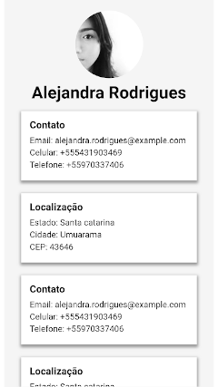

# Atomic
App criado com *create-next-app*

## Rodar a aplicação: 
> docker-compose up

## Rodar os testes:
> nvm use && npm install && npm run test

## Adicionais (pedidos na terça-feira)
### Testes unitários de regras de negócio
Adicionei os testes de regras de filtragem dentro da pasta **store**. Na pasta __test__ da raiz estão os
testes de snapshot que estavam dentro de Pages e precisaram ser removidos por conta de uma convenção de build do Next.
### Containerização da aplicação
Criei o Dockerfile e o docker-compose.yml.
### Definição de versão do NodeJS
Basta rodar o comando *nvm use* para utilizar a versão correta do nodeJs para o projeto.
Também está definida a versão no package.json
### Layout com CSS (sem framework)
A página de detalhes do cliente está desenvolvida sem o uso do MaterialUI.
Como não tem muitas informações para mostrar sobre um único cliente e o objetivo dessa implementação
é mostrar um pouco de CSS, repeti alguns itens no grid para demonstrar a responsividade.
  

## Ferramentas utilizadas
- NextJs
- React 
- Hooks
- MaterialUI
- Ramda
- Lodash
- Libphonenumber-js
- Shortid

## Fora do escopo porque não deu tempo
- Tela de detalhe do cliente.
- Filtro de localização "Trabalhoso"
- Ducks (Actions, reducers, etc)

## Pontos de atenção
Na descrição do escopo, os critérios de cordenadas não fazem sentido.
Alterei o "max" para valores positivos.

### Filtro por coordenada
#### Antes:
```json
minlon: -2.196998
minlat -46.361899
maxlon: -15.411580
maxlat: -34.276938
```

#### Depois
```json
minlon: -2.196998,
minlat: -46.361899,
maxlon: 15.411580,
maxlat: 34.276938,
```

### Filtro por região
Criei um arquivo com um *de/para* de regiões e estados para os critérios deste filtro.

